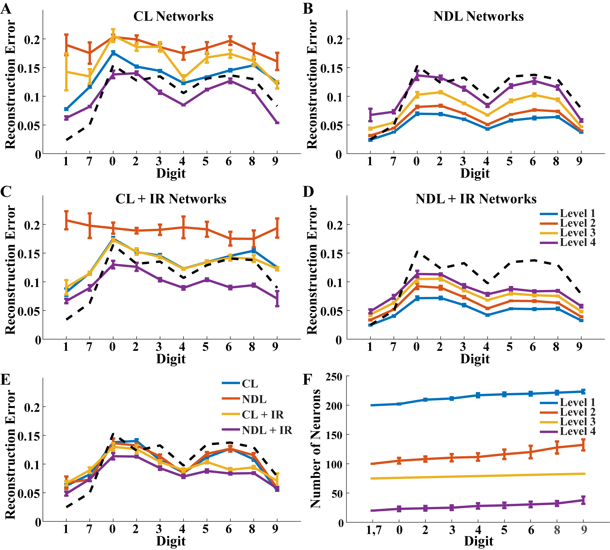
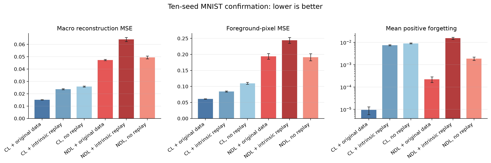
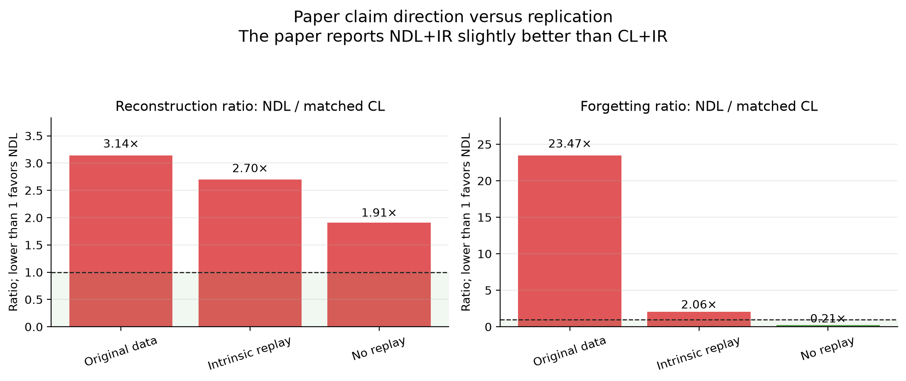
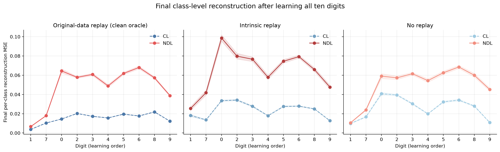
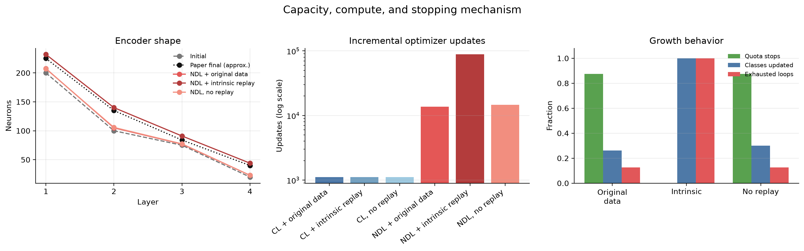
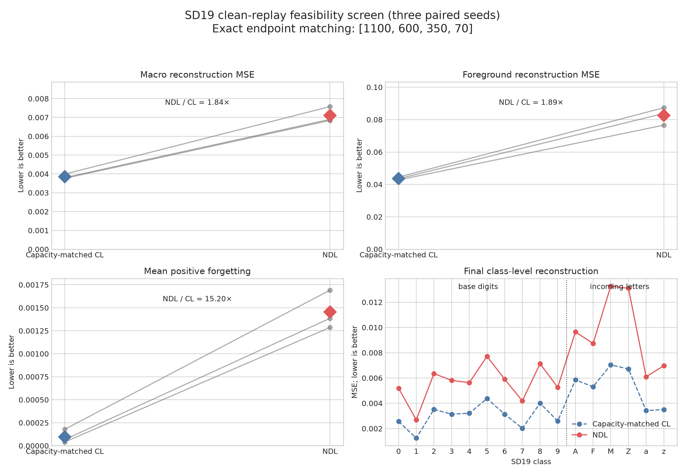
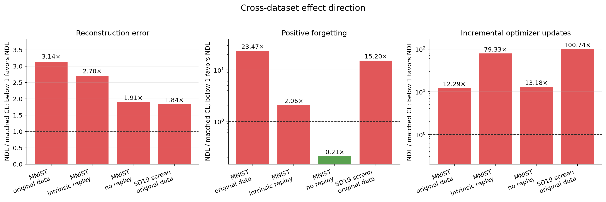
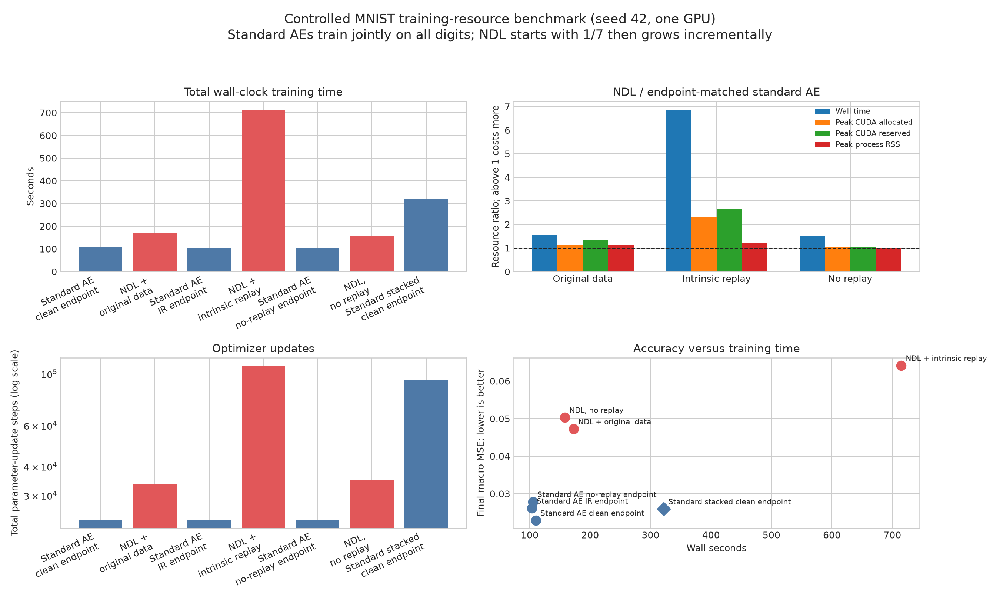

# Full replication report: Neurogenesis Deep Learning

**Date:** 2026-07-14  
**Paper:** Draelos et al., *Neurogenesis Deep Learning: Extending deep networks to accommodate new classes*  
**Replication scope:** MNIST, ten independent seeds (`42`--`51`), mechanism and growth-policy ablations, and a three-seed paired SD19 feasibility screen

## Executive verdict

The paper's central MNIST comparison did **not** replicate. The paper reports
that neurogenesis with intrinsic replay (NDL+IR) slightly outperforms a
capacity-matched conventional learner with intrinsic replay (CL+IR), including
better preservation of old classes. In the replication, the paper-faithful
NDL+IR interpretation has `0.06395` macro reconstruction MSE versus `0.02367`
for matched CL+IR: NDL is **2.70 times worse**. Mean positive forgetting is
`0.01531` versus `0.00742`: NDL forgets **2.06 times more** by this measure.

There is no single honest answer to “which implementation is closest” without
specifying what must be close:

| Meaning of closest | Closest implementation | Verdict |
|---|---|---|
| Published mechanism | **NDL + intrinsic replay** | It implements demand-triggered layer growth, local SHL-AE updates, mature-weight protection, and Gaussian latent replay. It is the primary replication, but it fails the published performance ordering. |
| Published final encoder shape | **Cumulative-cap reference** (`[225,135,83,40]`) | Only one neuron from the visually estimated paper endpoint (`[225,135,~84,40]`), but the shape is imposed by the growth allowance and is not emergent evidence. |
| Best reconstruction performance | **Matched CL + original-data replay** (`0.01508`) | This is a clean-data upper-bound control, not a replication of intrinsic replay. |
| Best condition that reopens no old data | **Matched CL + intrinsic replay** (`0.02367`) | It stores latent statistics rather than historical images and remains substantially better than NDL+IR. |
| Best condition with no replay at all | **Matched CL without replay** (`0.02588`) | NDL without replay retains old classes better, but its total reconstruction error is 1.91 times higher. |
| Published qualitative result | **None** | No NDL replay regime beats its capacity-matched CL counterpart on macro MSE. |

The strongest defensible conclusion is therefore not that neuron growth can
never work. It is that the benefit claimed in the paper is **not robustly
identified by the publication**: plausible paper-compatible choices reproduce
the network shape but not the performance advantage. The result depends on
undocumented optimizer, activation, threshold, schedule, growth-limit, and
replay details.

A controlled seed-42 resource benchmark reaches the same direction operationally:
endpoint-matched ordinary autoencoders train in about `104--110` seconds, while
NDL takes `158--715` seconds. Intrinsic-replay NDL is `6.88x` slower and uses
`2.31x` the peak live CUDA memory of the same-size standard autoencoder.

## Evidence available from the original work

The repository includes the complete arXiv source bundle, including
[`NeurogenesisDeepLearning.tex`](papers/arxiv-1612.03770v2/NeurogenesisDeepLearning.tex),
the bibliography, all figures, and the original tar archive. Thus the paper is
available as LaTeX. No original implementation, raw experimental table, seed
list, or machine-readable Figure 4 values are included.

The paper specifies:

- a stacked denoising autoencoder initially trained on digits `1` and `7`;
- encoder widths `[200,100,75,20]` and mirrored decoder widths;
- incoming digits in order `0,2,3,4,5,6,8,9`, one complete class at a time;
- outliers selected by reconstruction error at each depth;
- new encoder neurons trained at full learning rate, mature encoder weights
  frozen, and old decoder weights trained at `LR/100` during plasticity;
- stabilization using the new class and intrinsic replay of older classes;
- intrinsic replay produced by sampling a class-conditional Gaussian in the
  top latent layer and decoding it;
- final capacity selected by reconstruction demand, subject to an unspecified
  maximum number of new nodes.

It does not specify exact activations, optimizer, numerical thresholds,
outlier quota, minibatch size, how reported phase counts map to epochs or
updates, maximum-node lifetime, exact next-layer update scope, number of
independent runs, uncertainty, or numeric final errors. These gaps prevent an
exact binary-equivalent reconstruction of the experiment.

### Original published result



Figure 4 qualitatively places NDL+IR below CL+IR in reconstruction error and
shows a funnel growing to approximately `[225,135,84,40]`. Because its values
are rasterized and no raw data is supplied, the replication does not claim a
numerical distance from the original curves. The statistically valid
comparison is the **direction of the paper's claim**, not fabricated precision
from pixels in a figure.

## Replication design

All confirmatory runs use MNIST, the paper's base classes and learning order,
the same initial funnel, and ten independent seeds. Evaluation uses the held-out
validation data; no test-set result was used for model selection. Reported
intervals are two-sided 95% Student-t confidence intervals over seeds.

The six-condition factorial comparison separates architecture/training from
replay quality:

| Growth/training | Replay regime | Purpose |
|---|---|---|
| Capacity-matched conventional learner (CL) | Original old-class data | Clean upper bound for ordinary training |
| CL | Intrinsic Gaussian replay | Paper's fixed-network IR control |
| CL | None | Sequential-learning baseline |
| Neurogenesis (NDL) | Original old-class data | Clean upper bound for the growth mechanism |
| NDL | Intrinsic Gaussian replay | Closest mechanistic replication of NDL+IR |
| NDL | None | Growth without stabilization replay |

For each replay regime, CL is matched to the corresponding NDL endpoint. The
original-data condition is deliberately retained: if the growth method fails
with perfect historical samples, imperfect generated replay cannot be the sole
cause.

An audit of the first report draft found that its no-replay CL control had been
matched to the larger intrinsic-replay endpoint rather than the no-replay NDL
endpoint. That control was rerun for all ten seeds using each seed's exact NDL
widths. All tables, figures, and ratios below use the corrected control. The
clean-replay and intrinsic-replay comparisons were already correctly matched.

## Main ten-seed results

Lower values are better.

| Condition | Macro MSE, mean [95% CI] | Foreground MSE | Positive forgetting | Updates | Parameters | Final encoder widths |
|---|---:|---:|---:|---:|---:|---|
| CL + original data | **0.01508** [0.01498, 0.01517] | **0.06091** | **0.000009** | 1,113 | 389,343 | `[207,105,77,23]` |
| CL + intrinsic replay | 0.02367 [0.02329, 0.02405] | 0.08410 | 0.00742 | 1,113 | 463,978 | `[232,140,91,44]` |
| CL, no replay | 0.02588 [0.02547, 0.02629] | 0.10956 | 0.00897 | 1,113 | 390,097 | seed-matched near `[207,106,78,23]` |
| NDL + original data | 0.04733 [0.04678, 0.04788] | 0.19388 | 0.000222 | 13,674 | 390,233 | near `[208,105,77,23]` |
| NDL + intrinsic replay | **0.06395** [0.06226, 0.06565] | **0.24402** | **0.01531** | 88,292 | 463,978 | `[232,140,91,44]` |
| NDL, no replay | 0.04944 [0.04830, 0.05059] | 0.19113 | 0.00187 | 14,668 | 390,097 | near `[207,106,78,23]` |



The confidence intervals are narrow and non-overlapping for the main
reconstruction comparisons. These are not isolated unlucky seeds. NDL macro
MSE divided by its matched CL value is:

- `3.14x` with original-data replay;
- `2.70x` with intrinsic replay;
- `1.91x` without replay.

The clean upper bound is especially diagnostic. NDL remains much worse than CL
even when both can use exact old-class images. Therefore replay sample quality
is **not sufficient** to explain the failure; the local growth/training pathway
itself is implicated.



For forgetting, NDL without replay is better than its matched CL control
(`0.21x` the positive forgetting), but this does not translate into competitive
reconstruction: its macro MSE remains `1.91x` worse. The paper claims both good
acquisition and retention. Improving one measure while substantially degrading
the other does not reproduce that claim.

## Class-level behavior



The failure is distributed across the curriculum rather than confined to one
digit. With intrinsic replay, NDL is worse on every final per-class curve than
matched CL. The largest visible discrepancy is the first incoming digit `0`,
which remains close to `0.10` MSE for NDL+IR. Base digits `1` and `7` remain
easier, but NDL still does not achieve the conventional learner's error.

This pattern is consistent with a mismatch between the quantity that triggers
growth and the quantity optimized during growth. Outliers are selected using
global pixel reconstruction error at a particular depth, whereas each growth
phase optimizes an isolated local single-hidden-layer autoencoder. Diagnostics
show that local and global errors can become weakly correlated or negatively
correlated in deeper layers. A local improvement therefore need not remove the
global outliers that keep requesting neurons.

## Does the architecture emerge?



The experiments distinguish three superficially similar outcomes:

1. **Cap-driven shape.** The cumulative-cap reference reaches
   `[225,135,83,40]`, only `0.21%` relative L1 distance from the approximate
   paper endpoint. It consumes the configured allowance, so this is a
   reproduction of a shape, not evidence that demand discovered it.
2. **Threshold-refresh funnel.** With clean replay, learned-class threshold
   refresh produces about `[207,105,77,23]` and a `0.875` quota-stop fraction.
   However, only `26.3%` of incoming classes update on average. Much of the
   apparent organicity is later classes producing no demand rather than
   successful repeated growth and stopping.
3. **Intrinsic-replay growth.** The closest paper mechanism reaches
   `[232,140,91,44]`, reasonably near the visual paper shape, but every one of
   the 32 class/layer loops exhausts its local allowance in every seed. The
   endpoint is again controlled by limits, while generated replay keeps the
   incoming classes persistently novel.

The NDL+IR run uses about `79.3x` the optimizer updates of matched CL
(`88,292 / 1,113`) without a performance benefit. This is much larger than the
paper's qualitative expectation of a constant-factor processing overhead.

## Ablation lineage

These five-seed full-curriculum ablations explain how the final candidate was
chosen. They are mechanism diagnostics and should not be pooled with the
ten-seed factorial estimates.

| Variant | Paper status | Seeds | Macro MSE | Forgetting | Endpoint-distance | Updates | Growth interpretation |
|---|---|---:|---:|---:|---:|---:|---|
| Cumulative-cap reference | Compatible ambiguity | 5 | 0.04638 | 0.000003 | **0.21%** | 7,180 | Excellent shape match, allowance-driven |
| Learned-class threshold refresh | Compatible ambiguity | 5 | 0.04763 | 0.000183 | 14.83% | 13,443 | Mostly later-class demand stops |
| Refresh + global criterion coupling | Explicit non-paper diagnostic | 5 | **0.04248** | 0.000152 | 14.50% | 15,599 | Better error, but update coverage still weak |

The non-paper coupling result supports the local/global mismatch diagnosis: a
change that couples optimization more directly to the global criterion improves
macro MSE by about `10.8%` relative to ordinary threshold refresh. It still does
not establish organic growth or approach matched CL performance.

Earlier partial-curriculum screens found that sigmoid hidden layers with an
identity latent layer improved the selected reference, and 25 epochs of
end-to-end fine-tuning reduced macro MSE from `0.03519` to `0.02749`. Neither
change made growth stop organically. End-to-end fine-tuning is also not stated
in the paper and is treated as an extension, not evidence for replication.

## SD19 follow-up feasibility comparison

After the MNIST confirmation, a preregistered SD19 extension tested whether the
larger and more varied character domain makes dynamic growth advantageous. The
screen used the paper's ten digit base classes, six representative incoming
letters (`A`, `F`, `M`, `Z`, `a`, `z`), the published
`[1000,500,250,50]` initial architecture, clean original-data replay, and three
paired seeds. Training and validation were bounded at 512 and 128 samples per
class for this feasibility decision. For each seed, CL was trained at the exact
endpoint produced by NDL.

| Condition | Seeds | Macro MSE | Foreground MSE | Positive forgetting | Updates | Runtime | Endpoint |
|---|---:|---:|---:|---:|---:|---:|---|
| Capacity-matched CL + original data | 3 | **0.003854** | **0.04362** | **0.000096** | 72 | 53.0 s | `[1100,600,350,70]` |
| NDL + original data | 3 | 0.007106 | 0.08257 | 0.001454 | 7,253 | 236.0 s | `[1100,600,350,70]` |



NDL lost all three paired seeds. Its mean macro MSE was `1.843x` the matched CL
value, foreground MSE was `1.893x`, and positive forgetting was `15.20x`.
NDL required about `100.7x` as many incremental optimizer updates and `4.46x`
the wall time. Every NDL seed consumed the complete global growth allowance,
only one of six incoming classes performed updates, the quota-stop fraction was
`0.125`, and 21 class/layer loops ended both unresolved and capacity-exhausted.

The promotion gate required at least three pairs, mean NDL/CL macro MSE no more
than `0.95`, NDL wins in at least two-thirds of seeds, and non-worse mean
forgetting. The observed values were `1.843`, `0/3`, and a forgetting increase
of `0.001359`, so the gate failed every substantive criterion. Consequently,
the full 52-letter intrinsic-replay matrix and 20 shuffled curricula were not
run. This is a preregistered futility stop, not missing execution.

The SD19 audit also found and fixed a configuration defect: the experiment YAML
placed `[1000,500,250,50]` under `experiment.model`, while the runner constructs
the network from top-level `model`. Existing SD19 presets therefore resolved to
the small default architecture. All SD19 paper presets and the legacy paper
runner now override the top-level model explicitly, and regression tests verify
the published architecture.

## Cross-dataset synthesis



Ratios below compare NDL with its capacity-matched CL control. Values below one
favor NDL; values above one favor CL.

| Dataset and replay | Reconstruction ratio | Forgetting ratio | Update ratio | Interpretation |
|---|---:|---:|---:|---|
| MNIST, original data | 3.14x | 23.47x | 12.29x | Growth loses acquisition and retention despite perfect replay |
| MNIST, intrinsic replay | 2.70x | 2.06x | 79.33x | Closest paper mechanism loses both objectives at the highest MNIST cost |
| MNIST, no replay | 1.91x | **0.21x** | 13.18x | Mature-weight protection improves retention but impairs acquisition |
| SD19 screen, original data | 1.84x | 15.20x | 100.74x | Larger architecture narrows the error ratio but greatly amplifies compute |

The forgetting ratios with clean replay should not be overinterpreted: their
CL denominators are very close to zero. The absolute differences point in the
same direction, but the ratios look dramatic partly because conventional
learning with original data forgets almost nothing.

### What is consistent across datasets

1. **Replay quality is not the primary bottleneck.** NDL loses to matched CL on
   both MNIST and SD19 when exact historical images are available. Intrinsic
   replay adds another failure mode, but it is not needed to produce the core
   gap.
2. **Growth is not finding a demonstrated optimum.** MNIST intrinsic replay and
   SD19 consume their allowances, while clean MNIST growth has low active-class
   coverage. A final funnel is therefore insufficient evidence for emergent
   capacity allocation.
3. **The stability mechanism can work in isolation.** Without replay, freezing
   mature encoder weights reduces forgetting to about one-fifth of matched CL.
   The same constraint limits the acquisition of new representations, leaving
   macro reconstruction nearly twice as high.
4. **Compute scales poorly in the observed pathway.** NDL requires 12--79 times
   the matched CL updates on MNIST and about 101 times on the SD19 screen. The
   paper's expected constant-factor overhead is not supported by these runs.
5. **Greater task complexity does not reverse the result.** The reconstruction
   ratio is smaller on the bounded SD19 screen (`1.84x`) than on clean MNIST
   (`3.14x`), but the protocols, architectures, and sample limits differ. This
   cannot be extrapolated into a claim that sufficiently large tasks will favor
   NDL.

### Acquisition, retention, and efficiency form a three-way test

The original paper primarily presents reconstruction curves and qualitative
stability. The replication shows why all three axes must be reported together:

- **Acquisition:** can the final model reconstruct the complete learned
  curriculum?
- **Retention:** do old classes degrade as new classes arrive?
- **Efficiency:** how much capacity and optimization are required?

NDL without replay wins only the retention axis. NDL with clean or intrinsic
replay wins none of the three. Consequently, no tested NDL condition lies on a
better acquisition/retention/compute trade-off frontier than the appropriate
CL controls.

## Training time and peak-memory analysis

This resource benchmark ran every condition serially in a fresh process on one
NVIDIA RTX PRO 4000 Blackwell GPU using seed 42. Fresh processes reset CUDA
peaks and process RSS. NDL starts from digits `1` and `7`, performs the paper-
compatible stacked base pretraining, and then grows through the incremental
curriculum. The primary standard AE trains end to end for 50 epochs on all ten
digits jointly at the exact final width produced by its NDL counterpart.

The standard AE is an **offline retraining baseline**, not a continual learner:
it assumes simultaneous access to every class. This is intentional for the
requested operational comparison—how expensive is the full NDL procedure
relative to simply training the resulting architecture normally? A compact
stacked-denoising standard AE is also included to isolate the cost of the
paper's layer-wise pretraining recipe.



| Training condition | Final widths | Wall time | Peak CUDA allocated | Peak CUDA reserved | Peak process RSS | Total updates | Macro MSE |
|---|---|---:|---:|---:|---:|---:|---:|
| Standard AE, clean endpoint | `[207,105,77,23]` | 110.1 s | 72.6 MiB | 76 MiB | 1,963 MiB | 23,450 | 0.02291 |
| NDL + original data | `[207,105,77,23]` | 172.6 s | 81.5 MiB | 102 MiB | 2,193 MiB | 33,753 | 0.04724 |
| Standard AE, IR endpoint | `[232,140,91,44]` | 103.9 s | 74.0 MiB | 78 MiB | 1,962 MiB | 23,450 | 0.02612 |
| NDL + intrinsic replay | `[232,140,91,44]` | 714.5 s | 170.8 MiB | 206 MiB | 2,384 MiB | 108,698 | 0.06415 |
| Standard AE, no-replay endpoint | `[207,105,78,23]` | 105.2 s | 72.6 MiB | 76 MiB | 1,967 MiB | 23,450 | 0.02785 |
| NDL, no replay | `[207,105,78,23]` | 158.0 s | 74.9 MiB | 78 MiB | 1,982 MiB | 34,905 | 0.05031 |
| Standard stacked AE, clean endpoint | `[207,105,77,23]` | 321.8 s | 72.0 MiB | 74 MiB | 1,976 MiB | 93,800 | 0.02593 |

### Endpoint-matched NDL overhead

| NDL variant versus ordinary same-size AE | Wall time | CUDA allocated | CUDA reserved | Process RSS | Updates | MSE |
|---|---:|---:|---:|---:|---:|---:|
| Original-data replay | 1.57x | 1.12x | 1.34x | 1.12x | 1.44x | 2.06x |
| Intrinsic replay | **6.88x** | **2.31x** | **2.64x** | 1.21x | **4.64x** | **2.46x** |
| No replay | 1.50x | 1.03x | 1.03x | 1.01x | 1.49x | 1.81x |

### Resource interpretation

1. **Intrinsic replay is the dominant resource multiplier.** It combines the
   widest endpoint with replay sampling, decoding, threshold refresh, and
   repeated stabilization. This raises live CUDA memory from 74.0 to 170.8 MiB
   and wall time from 103.9 to 714.5 seconds.
2. **Growth without replay is primarily a time cost, not a memory cost.** Its
   CUDA and RSS peaks are within about 3% and 1% of the ordinary AE, but repeated
   local phases still make it 50% slower and require 49% more updates.
3. **Process RAM is dominated by framework and dataset state.** All runs occupy
   roughly `1.96--2.38` GiB RSS even though the models contain only
   `389k--464k` parameters. GPU allocator peaks are more sensitive to replay
   batch construction than model parameter count.
4. **The layer-wise schedule is expensive by itself.** The standard stacked AE
   takes 321.8 seconds and 93,800 updates versus 110.1 seconds and 23,450 updates
   for the usual end-to-end AE. Its peak memory is nearly unchanged and its MSE
   is 13.2% worse. Here, 50 stacked epochs means 50 epochs at each of four
   levels—effectively 200 layer-epochs.
5. **Ordinary training dominates the tested NDL variants operationally.** At
   every exact endpoint, the joint end-to-end AE has lower wall time, fewer
   updates, lower peak memory, and lower final MSE. NDL's rationale must
   therefore rest on unavailable-old-data or online-adaptation constraints, not
   on cheaper training when the full dataset can be reopened.

These measurements are a controlled single-seed profile, not confidence
intervals. Absolute wall times are hardware- and software-specific; update
counts and within-machine ratios are more portable. They also measure training
only—not checkpoint storage, long-term replay-statistic storage, data-retention
cost, or inference latency.

## Fidelity assessment

| Component | Replication status | Consequence |
|---|---|---|
| Initial classes, order, architecture, stacked denoising pretraining | Matched | Core task setup is aligned |
| Global error/outlier selection at every level | Matched | Growth is driven by the paper's stated signal |
| Local SHL-AE plasticity; mature encoder frozen; decoder at LR/100 | Matched | Main neurogenesis update structure is present |
| Stabilization with new and replayed classes | Matched structurally | Exact replay balance is undocumented |
| Full-covariance class Gaussian at top latent layer, then decode | Matched | Intrinsic replay is literal rather than a modern generative substitute |
| No reopening old data in intrinsic runs | Matched and regression-tested | IR condition is no longer contaminated by clean replay |
| Activations and optimizer | Paper-compatible selection | Publication does not identify them |
| Threshold percentile and outlier quota | Paper-compatible selection | Numerically decisive and undocumented |
| Phase duration interpretation | Paper-compatible selection | Normalized to data epochs/updates; original meaning is unclear |
| Node maximum and scope | Ambiguous | Can determine the final shape directly |
| Next-layer trainable parameter scope | Ambiguous | `paper_columns` is a documented interpretation |
| Global coupling and end-to-end fine-tuning | Non-paper extensions | Diagnostic only; excluded from replication claim |

Corrected implementation defects include accidental AdamW weight decay,
mislabelled dataset replay in IR presets, old-data access during intrinsic
statistic refresh, stale replay in no-replay regimes, shuffled outlier identity,
an SD19 architecture override placed in the wrong configuration namespace,
redundant full SD19 filesystem scans, and a tensor-cloning failure in partial
forwards. Regression tests cover these paths. Remaining differences are
publication ambiguities rather than known silent implementation errors.

The analysis also corrected a control-design defect rather than an algorithm
implementation defect: the original no-replay CL confirmation was oversized.
Ten seed-specific reruns now match its NDL pair exactly and replace the
confounded values throughout this report.

## What the result says about the original approach

### Supported observations

- Reconstruction demand can trigger growth at several layers.
- A funnel resembling the published final network can be produced.
- Protecting mature weights can reduce measured forgetting in some regimes.
- Replay quality and threshold provenance materially change growth behavior.

### Observations not supported by this replication

- NDL+IR does not outperform capacity-matched CL+IR.
- NDL does not outperform matched CL even with perfect old-data replay.
- The published-looking funnel is not shown to be an optimal, organically
  discovered capacity allocation.
- Literal Gaussian intrinsic replay does not stabilize growth here; it worsens
  reconstruction by `35.1%` relative to NDL's clean-replay upper bound and
  makes all growth loops exhaust their allowance.
- The additional computation is not rewarded by better reconstruction.
- Without replay, NDL does reduce forgetting, but the gain is coupled to much
  worse total reconstruction and does not reproduce the paper's combined
  acquisition-and-retention claim.

### Interpretation

The biologically inspired idea remains interesting, but the published evidence
is **under-specified and fragile**. Matching the endpoint architecture is not a
validation of the algorithm because the same shape can be induced by limits.
The clean-data result indicates a more fundamental issue: locally training new
neurons under mature-weight constraints is not enough to optimize the global
reconstruction criterion used to judge capacity.

The corrected no-replay comparison makes the mechanism more interpretable.
Freezing mature features is genuinely stabilizing, but the current local
plasticity path does not learn enough complementary capacity. Replay should, in
principle, relax that trade-off by rehearsing old classes during stabilization;
in practice, clean replay still leaves NDL over three times worse than matched
CL, while intrinsic replay drives persistent novelty and cap exhaustion. The
missing ingredient is therefore not simply “more replay,” but an update
objective that couples new local features to useful global reconstruction
without unnecessarily disrupting mature features.

### Recommended next research steps

1. Obtain the authors' original code, numeric Figure 4/7 data, thresholds,
   activations, optimizer, and node-limit policy before claiming a literal
   numerical replication.
2. Treat global reconstruction coupling as the primary mechanistic ablation.
   Compare local SHL-AE training with a short end-to-end or decoder-coupled
   objective while retaining mature-encoder protection.
3. Measure incoming-class acquisition and old-class retention separately at
   every step, then select configurations on a Pareto frontier rather than one
   final macro MSE.
4. Recalibrate novelty thresholds against the representation actually optimized
   during growth. A global stopping signal paired with a weakly correlated local
   loss is structurally prone to exhausting capacity.
5. Do not run the full 52-letter SD19/20-order campaign unless an NDL candidate
   first beats matched CL in the clean-replay feasibility gate. A forced run
   would be exploratory engineering, not promoted replication evidence.

This study does not prove the original reported curves were wrong, and it is
not a universal rejection of dynamic expansion. It shows that the claim cannot
currently be reproduced from the paper alone under a carefully audited,
plausible implementation. Releasing the original code, numeric results, exact
hyperparameters, and seeds would be required to distinguish an implementation
interpretation gap from a fragile original result.

## Limitations

- Original Figure 4 has no raw values or uncertainty, so absolute numeric
  agreement cannot be scored reliably.
- The original reconstruction-error reduction and this report's normalized MSE
  may differ in scaling; directional comparisons are more trustworthy than
  comparing y-axis magnitudes across the two projects.
- Hyperparameters omitted by the paper necessarily remain interpretations.
- The confirmatory matrix covers MNIST. SD19 received a bounded three-seed,
  six-letter clean-replay feasibility screen; it is not a full 52-letter
  numerical replication.
- Results characterize this implementation and protocol, not all possible
  dynamically expandable autoencoders.

## Reproducibility and artifacts

Primary machine-readable aggregate:

- [`summary.json`](../outputs/ablations/organic_growth/confirmation_10seed_aggregate/summary.json)
- [`summary.csv`](../outputs/ablations/organic_growth/confirmation_10seed_aggregate/summary.csv)
- [`summary.md`](../outputs/ablations/organic_growth/confirmation_10seed_aggregate/summary.md)
- [SD19 paired summary](../outputs/sd19/feasibility_screen/summary.json)
- [SD19 promotion gate](../outputs/sd19/feasibility_screen/gate.json)
- [Corrected seed-matched MNIST no-replay control](../outputs/ablations/organic_growth/confirmation_cl_noreplay_seed_matched_correction/summary.json)
- [Training-resource benchmark](../outputs/benchmarks/training_resources_seed42/summary.json)
- [Training-resource metadata](../outputs/benchmarks/training_resources_seed42/metadata.json)
- [Portable figure-data manifest](figures/replication/data/manifest.json)
- [Complete figure base-data bundle](figures/replication/data/replication_figure_base_data.json)

### Portable diagram data

Every diagram has normalized CSV source tables in
[`figures/replication/data/`](figures/replication/data/). Observation-level
tables preserve individual seeds and per-class measurements; summary tables
preserve the exact means, confidence intervals, and ratios plotted in this
report. The JSON bundle additionally retains the structured source rows,
including growth reports and configuration details.

| Diagram | Portable data |
|---|---|
| Performance comparison | `mnist_condition_metrics.csv`, `mnist_seed_metrics.csv` |
| Per-class comparison | `mnist_per_class_summary.csv`, `mnist_per_class_seed.csv` |
| Capacity and mechanism | `mnist_architecture.csv`, `mnist_condition_metrics.csv`, `mnist_seed_metrics.csv` |
| Claim direction | `mnist_claim_ratios.csv` |
| Cross-dataset effects | `cross_dataset_ratios.csv` |
| SD19 feasibility | `sd19_plotted_summary.csv`, `sd19_seed_metrics.csv`, `sd19_per_class_seed.csv` |
| Training resources | `training_resource_conditions.csv`, `training_resource_ratios.csv` |

CSV tables use long/tidy form where practical, and architecture-width cells
are valid JSON arrays. See `manifest.json` for the machine-readable mapping.

Supporting documents and code:

- [`algorithm_fidelity.md`](algorithm_fidelity.md)
- [`organic_growth_ablation_results_2026-07-13.md`](organic_growth_ablation_results_2026-07-13.md)
- [`plot_replication_report.py`](../scripts/plot_replication_report.py)
- [`run_sd19_comparison.py`](../scripts/run_sd19_comparison.py)
- [`run_mnist_noreplay_matched_control.py`](../scripts/run_mnist_noreplay_matched_control.py)
- [`benchmark_training_resources.py`](../scripts/benchmark_training_resources.py)
- [`plot_training_resources.py`](../scripts/plot_training_resources.py)
- [`export_replication_figure_data.py`](../scripts/export_replication_figure_data.py)
- [`plot_sd19_comparison.py`](../scripts/plot_sd19_comparison.py)
- [`summarize_confirmation.py`](../scripts/summarize_confirmation.py)

Regenerate the diagrams with:

```bash
.venv/bin/python scripts/plot_replication_report.py
.venv/bin/python scripts/plot_sd19_comparison.py
.venv/bin/python scripts/plot_training_resources.py
.venv/bin/python scripts/export_replication_figure_data.py
```

The plotting script verifies that each of the six conditions contains exactly
seeds `42`--`51` before producing any figure.

## Final conclusion

**NDL + intrinsic replay is the closest implementation of the published
mechanism, but it does not reproduce the published result.** The cumulative-cap
variant comes closest to the original shape, while capacity-matched CL with
original-data replay gives the best actual performance. Across every replay
regime, conventional learning reconstructs better than neurogenesis. The
original paper therefore remains an interesting proof-of-concept whose claimed
advantage is not independently established by this replication.
The SD19 feasibility extension strengthens that conclusion: even in the larger
character domain and with perfect historical replay, NDL was worse than its
exactly capacity-matched conventional control on acquisition, retention, and
compute.
