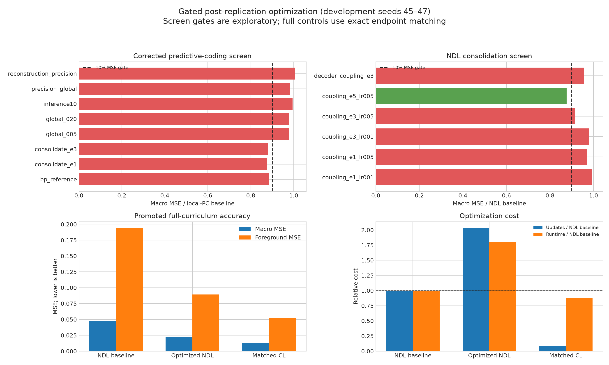

# Gated post-replication optimization results

This document reports research extensions performed after freezing the paper
replication. None of these results changes which implementation is considered
paper-compatible.

## Protocol

Development seeds `45–47` used identical seed-specific base checkpoints. The
screen introduced digit `0` using 512 training examples. Promotion required at
least a 10% macro-MSE improvement on the three-seed mean and no more than
`0.002` additional positive forgetting. Only promoted candidates entered the
full eight-class curriculum.



## Predictive-coding optimization

The corrected screen used sigmoid hidden activations and an identity latent
layer matching the saved checkpoints. Tested changes included layer precision,
five versus ten inference steps, weak global-loss terms, and one or three
explicit BP consolidation epochs.

| Candidate | Macro MSE | Ratio to local PC | Forgetting delta | Gate |
|---|---:|---:|---:|---|
| Local PC baseline | 0.03254 | 1.000 | 0 | baseline |
| Reconstruction precision | 0.03276 | 1.007 | +0.000002 | fail |
| Weak global loss (`0.05`) | 0.03177 | 0.976 | +0.000118 | fail |
| Ten inference steps | 0.03237 | 0.995 | +0.000010 | fail |
| One BP consolidation epoch | **0.02846** | **0.875** | +0.002251 | fail: forgetting |
| Three BP consolidation epochs | 0.02863 | 0.880 | +0.006769 | fail: forgetting |

The hybrid improves acquisition, but only by accepting more forgetting. No PC
candidate passes both locked objectives, so the corrected pipeline does not
promote a PC candidate to a full-curriculum confirmation. This supports the
earlier conclusion that local PC trades plasticity against stability rather
than dominating backpropagation.

An audit caught and preserved an excluded first-pass PC screen that loaded
sigmoid-trained checkpoints into the default activation graph. The corrected
PC results are isolated under `post_replication_pc_corrected`; the excluded
rows remain available for traceability but are not used here.

## NDL optimization

NDL used its clean original-data replay upper bound. The screen varied short
end-to-end consolidation phases after each class, including decoder-only and
all-weight scopes. Five all-weight epochs at `0.05` of the base learning rate
passed the gate:

| NDL screen | Macro MSE | Ratio | Positive forgetting | Gate |
|---|---:|---:|---:|---|
| Baseline | 0.04120 | 1.000 | 0.001363 | baseline |
| 3 epochs, LR ratio `0.05` | 0.03774 | 0.916 | 0.000692 | fail: <10% gain |
| Decoder-only, 3 epochs | 0.03941 | 0.957 | 0.001001 | fail |
| **5 epochs, LR ratio `0.05`** | **0.03609** | **0.876** | **0.000518** | **promote** |

### Full-curriculum result

Means over seeds `45–47`:

| Condition | Macro MSE | Foreground MSE | Forgetting | Updates | Runtime | Parameters |
|---|---:|---:|---:|---:|---:|---:|
| NDL baseline | 0.04816 | 0.19444 | 0.000179 | 13,330 | 102.1 s | 389,343 |
| **Optimized NDL** | **0.02289** | **0.08931** | **0.000000** | 27,147 | 183.7 s | 394,489 |
| Exact endpoint-matched CL | **0.01282** | **0.05282** | **0.000000** | 1,113 | 89.3 s | 394,489 |

Optimized NDL reduces macro MSE by `52.5%` relative to its paired baseline and
foreground MSE by `53.8%`. It requires `2.04x` the updates and `1.80x` the
runtime. Its endpoint varies across seeds (`[208,106,80,32]`, `[207,109,83,32]`,
and `[207,111,81,29]`) because consolidation changes subsequent growth demand.

The improvement is real but does not establish a neurogenesis advantage. The
exact capacity-matched conventional learner is `1.79x` better in macro MSE,
uses about one twenty-fourth as many incremental updates, and finishes in about
half the time of optimized NDL. The useful ingredient is therefore the added
global reconstruction coupling, not evidence that architectural growth itself
is superior.

## Reproducibility and portable data

- NDL screen/full raw results: `outputs/optimization/post_replication_gated/summary.json`
- Corrected PC screen: `outputs/optimization/post_replication_pc_corrected/summary.json`
- Exact CL controls: `outputs/optimization/optimized_ndl_matched_controls/summary.json`
- Portable screen table: `figures/replication/data/post_replication_optimization_screen.csv`
- Portable full seed table: `figures/replication/data/post_replication_optimization_full_seed.csv`
- Portable per-class table: `figures/replication/data/post_replication_optimization_per_class.csv`

```bash
.venv/bin/python scripts/run_post_replication_optimization.py --stage screen --quiet --resume
.venv/bin/python scripts/run_post_replication_optimization.py --stage full --quiet --resume
.venv/bin/python scripts/run_optimized_ndl_matched_controls.py --quiet --resume
.venv/bin/python scripts/plot_post_replication_optimization.py
```
