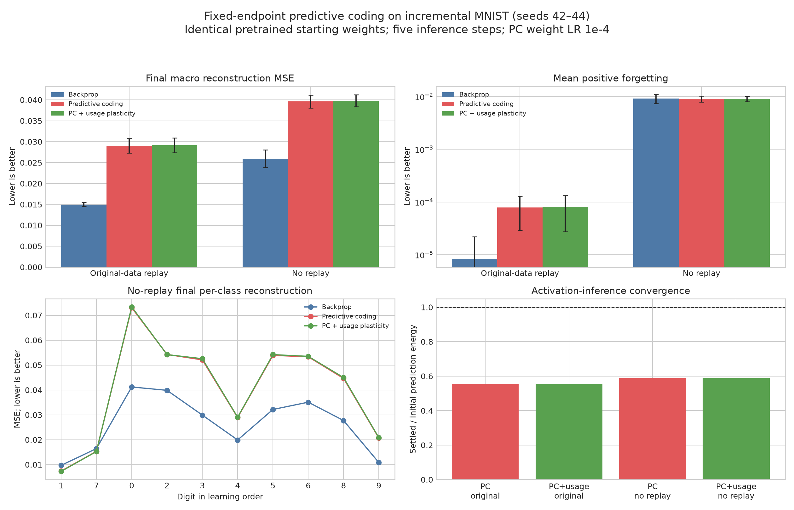

# Predictive-coding fixed-capacity extension

This is a post-replication research extension. It is not attributed to the
original Neurogenesis paper.

## Question and controlled design

Can local predictive-coding updates reproduce the useful mature/new-neuron
plasticity distinction without changing network size? Each condition starts
from the exact seed-specific base checkpoint and final architecture used by the
validated conventional-learning control. The base classes, incremental order,
data, replay samples, epochs, and evaluation are unchanged. Only incremental
optimization differs.

Predictive coding initializes every encoder and decoder activity by a forward
pass, clamps both the input and final reconstruction target, and performs five
hidden-activity relaxation steps (`inference_lr=0.05`). Each affine layer then
learns from its adjacent settled prediction error with activity targets
detached, preventing an end-to-end gradient path. The selected PC weight rate
is `1e-4`.

The usage variant maintains an exponential moving average of absolute hidden
activity. Underused units receive larger actual Adam parameter steps and highly
used units receive smaller steps, normalized to mean one and clipped to
`[0.25,4]`. Output pixels are excluded from this neuron-plasticity rule.



## Three-seed results

Means over seeds `42–44`; lower is better.

| Replay | Optimizer | Macro MSE | Foreground MSE | Positive forgetting |
|---|---|---:|---:|---:|
| Original data | Backpropagation | **0.01498** | **0.06030** | **0.000008** |
| Original data | Predictive coding | 0.02902 | 0.11778 | 0.000079 |
| Original data | PC + usage plasticity | 0.02915 | 0.11847 | 0.000081 |
| None | Backpropagation | **0.02595** | **0.11142** | 0.00917 |
| None | Predictive coding | 0.03964 | 0.16399 | **0.00905** |
| None | PC + usage plasticity | 0.03980 | 0.16441 | 0.00908 |

With clean replay, uniform PC has `1.94x` the macro MSE of backpropagation. With
no replay it has `1.53x` the macro MSE. Its no-replay forgetting is about `1.3%`
lower, which is negligible beside the reconstruction deficit and is not a
three-seed significance claim. Usage-dependent plasticity changes macro MSE by
less than one percent and is slightly worse in both replay regimes.

Activation inference itself is stable: settled prediction energy averages
`0.555` of initialization with original-data replay and `0.590` without replay.
Thus the negative result is not caused by divergent activity inference. It
instead indicates that minimizing all adjacent prediction errors under this
formulation does not produce as useful an incremental representation as the
end-to-end reconstruction gradient.

## Weight-rate screen

The backpropagation rate (`1e-3`) was unsuitable for direct local PC losses and
moved the seed-42 weights by L2 `70.1`. A predeclared seed-42 scale screen used
no replay:

| PC weight rate | Macro MSE | Positive forgetting | Weight displacement L2 |
|---:|---:|---:|---:|
| `1e-3` | 0.04777 | 0.02401 | 70.12 |
| `1e-4` | **0.03924** | 0.00876 | 9.83 |
| `1e-5` | 0.04225 | **0.00104** | 2.02 |

The `1e-4` setting was selected by final macro MSE before running seeds 43–44.
The screen also exposes the expected stability/plasticity trade-off: smaller
updates protect old classes but underfit incoming classes.

## Conclusion and limits

This tested predictive-coding optimizer does not outperform ordinary
backpropagation. It approximately preserves the no-replay forgetting rate but
substantially reduces acquisition quality. Usage-based neuron plasticity does
not improve the trade-off.

This is an exploratory three-seed comparison after a seed-42 learning-rate
screen, not a definitive evaluation of predictive coding as a whole. Other PC
energy functions, precision weights, amortized inference, inference depths, or
plasticity rules could behave differently. A ten-seed confirmation is not
warranted for the current formulation because it loses the primary metric in
every tested replay regime and seed.

## Reproducibility

Machine-readable results:

- [`summary.json`](../outputs/predictive_coding/fixed_endpoint_comparison_lr1e4/summary.json)
- [`comparison_rows.json`](../outputs/predictive_coding/fixed_endpoint_comparison_lr1e4/comparison_rows.json)
- [`aggregate.json`](../outputs/predictive_coding/fixed_endpoint_comparison_lr1e4/aggregate.json)
- [`aggregate.csv`](../outputs/predictive_coding/fixed_endpoint_comparison_lr1e4/aggregate.csv)

Commands:

```bash
.venv/bin/python scripts/run_predictive_coding_comparison.py --seeds 42,43,44 --quiet --resume
.venv/bin/python scripts/plot_predictive_coding_comparison.py
.venv/bin/python scripts/export_replication_figure_data.py
```
